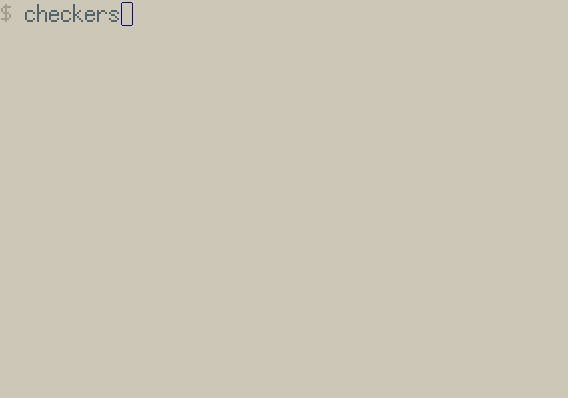
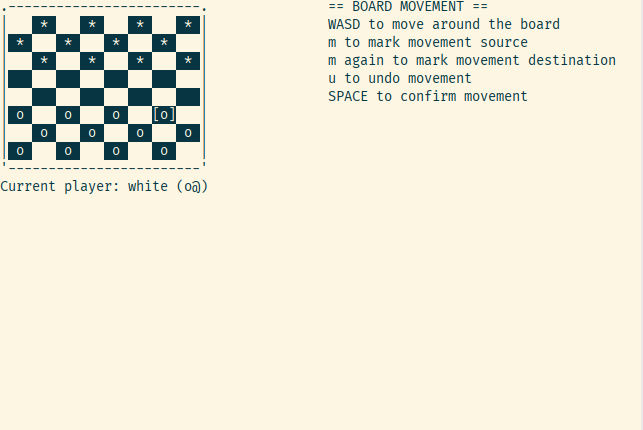

# checkers
A checkers game programmed in C that runs in the terminal.

I'm currently working on a more interactive terminal interface using ncurses.
Also planning to implement a minimax algorithm in the future for the player to play against the computer.

Here's the previous stdin/stdout-based interaction loop.

Here's the current ncurses-based interaction loop. You use WASD to cycle through
the options (W and D to go forward and A and S to go backwards).

